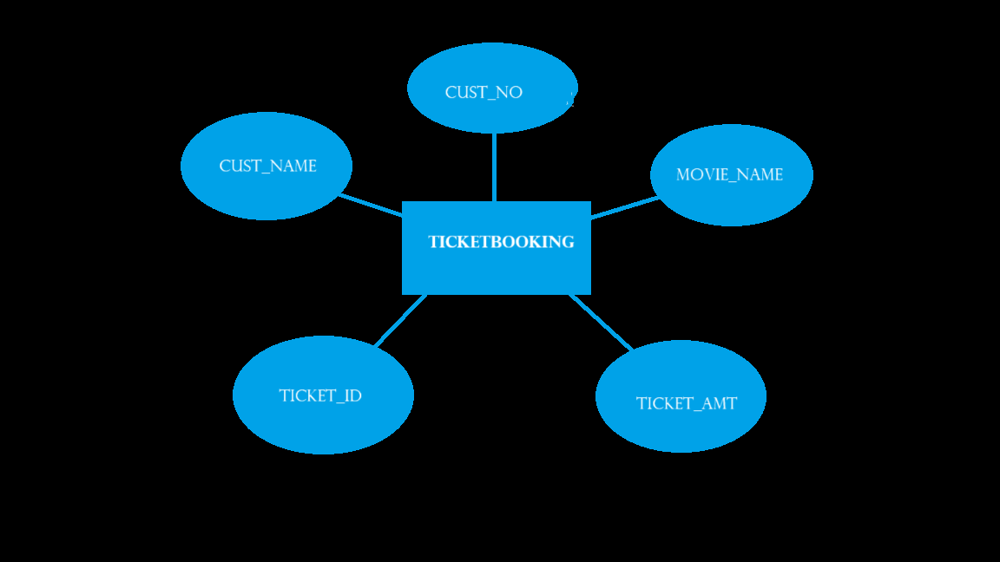
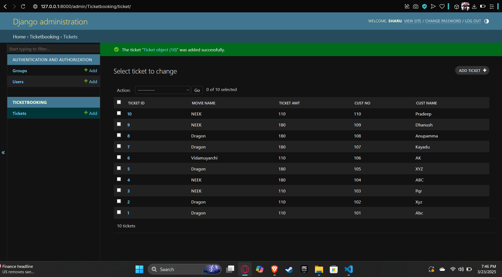

# Ex02 Django ORM Web Application
## Date: 

23/3/2025

## AIM
To develop a Django application to store and retrieve data from a Movies Database using Object Relational Mapping(ORM).

## ENTITY RELATIONSHIP DIAGRAM



## DESIGN STEPS

### STEP 1:
Clone the problem from GitHub

### STEP 2:
Create a new app in Django project

### STEP 3:
Enter the code for admin.py and models.py

### STEP 4:
Execute Django admin and create details for 10 books

## PROGRAM

```
models.py

from django.db import models

from django.contrib import admin

class Ticket(models.Model):
    Ticket_ID=models.IntegerField(primary_key=True)
    Movie_name=models.CharField(max_length=30)
    Ticket_Amt=models.IntegerField()
    cust_no=models.IntegerField()
    cust_name=models.CharField(max_length=30)

class TicketAdmin(admin.ModelAdmin):
    list_display=('Ticket_ID','Movie_name','Ticket_Amt','cust_no','cust_name')

admin.py

from django.contrib import admin
from .models import Ticket,TicketAdmin
admin.site.register(Ticket,TicketAdmin)

```

## OUTPUT

Include the screenshot of your admin page.




## RESULT
Thus the program for creating movies database using ORM hass been executed successfully
